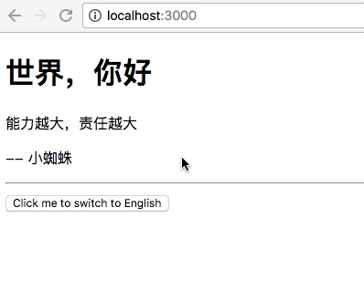

# angular4-translate
A translate module for Angular2/Angular4 Projects.

### How to install it?
``` npm install --save angular4-translate ```  
or   
``` npm install --save https://github.com/ZixiaoWang/angular2-translate.git ```

### How to use it?
Import ```TranslateModule``` and ```TranslateModule.forRoot(Config)```

**app.module.ts**  
```javascript
    import { TranslateModule, TranslateService } from 'angular4-translate';

    const dictionary: any = {
        en:{
            GREETING: 'Hello World',
            MESSAGE: {
                QUOTE: 'Great power comes great responsibility',
                SAIDBYWHOM: ' -- Peter Parker'
            },
            BUTTON: '点击我切换到简体中文'
        },
        zh:{
            GREETING: '世界，你好',
            MESSAGE: {
                QUOTE: '能力越大，责任越大',
                SAIDBYWHOM: ' -- 小蜘蛛'
            },
            BUTTON: 'Click me to switch to English'
        }
    };

    @NgModule({
        declarations:[...],
        imports:[
            ...
            TranslateModule,
            TransalteModule.forRoot(dictionary),
            ...
        ],
        providers:[...],
        ...
    })

    export class AppModule{

        constructor( private translate: TranslateService ){
            this.translate.setDefault('en');
        }
    }
```

**Any other component**  
```javascript
    import { Component } from '@angular/core';
    import { TranslateService } from 'angular4-translate';

    @Component({
        selector: 'my-component',
        template: `
            <div class="container">

                <!-- Use Pipe to translate -->
                <div class="row">
                    <h1>{{ 'GREETING' | translate }}</h1>
                </div>

                <!-- Use Directive to translate -->
                <div class="row">
                    <p translate="MESSAGE.QUOTE"></p>
                </div>

                <!-- Use Service to translate -->
                <div class="row">
                    <p>{{ translated }}
                </div>
            </div>

            <hr>

            <button (click)="toggleLanguage()">{{ 'BUTTON' | translate }}</button>
        `,
        styleUrl:[...]
    })

    export class MyComponnet {
        private translated: string;
        private count: number = 0;

        constructor( private translate: TranslateService ){
            this.translated = this.translate.instance('MESSAGE.SAIDBYWHOM');
        }

        toggleLanguage(){
            let language = this.count % 2 === 0 ? 'en' : 'zh';

            this.translate.use(language);
            this.translated = this.translate.instance('MESSAGE.SAIDBYWHOM');

            this.count ++;
        }
    }
```

### Effect
